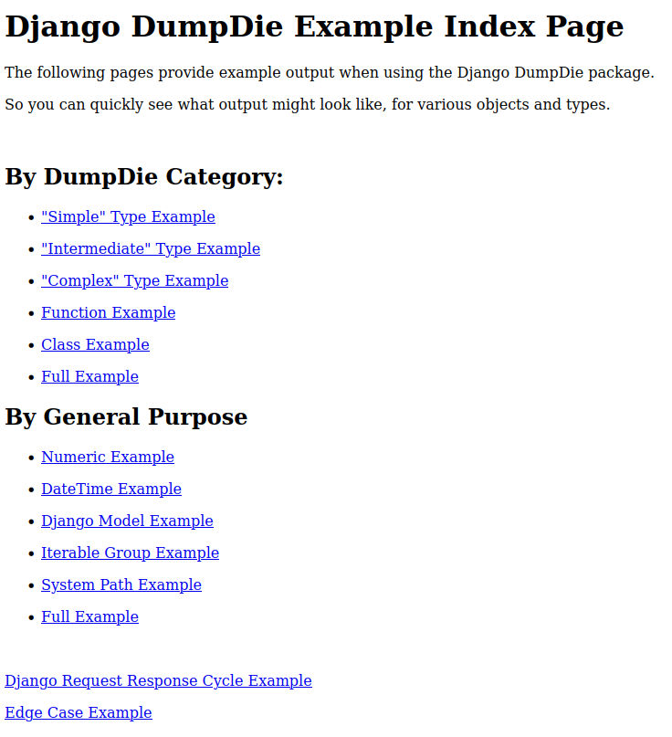

Built-In DD Examples
********************

To help showcase functionality (and help with DD internal
debugging/development), the DumpDie project has built-in example views.
The following describes how to access them from a given Django project.

.. note::

    These built-in example views are also a good way to test various
    :doc:`Django DumpDie configuration settings <configuration>`, and see what
    configuration works best for your local setup.

1. First, follow the installation instructions from the :doc:`quickstart` page,
   to initially set up DD for your project.

2. Update your site root urls to include the following:

    .. warning::

        For production deployment, you probably don't want this url added to
        your project.
        It's probably best to not commit this line to your repository,
        and to remove it before deployment in event that it is accidentally
        committed.

        These urls are meant for debugging and example output only.

    .. code-block:: python

        urlpatterns = [

            path('dd/', include('django_dump_die.urls')),
            ...
        ]

3. Launch your project with the standard ``python manage.py runserver`` command.

4. Open a new web browser to ``http://127.0.0.1:8000/dd/``. You should see page
   output similar to below.

----

----

5. From here, click any of the links to view what the DD project looks like,
   for each given output grouping.

   For example:

   * ``"Simple" Type`` refers to very basic types, such as ``int``,
     ``str``, ``bool``, and similar types.
   * ``"Intermediate" Type`` refers to
     `DateTime <https://docs.python.org/3/library/datetime.html>`_ and
     `PathLib <https://docs.python.org/3/library/pathlib.html>`_, and similar
     types.
   * ``"Complex" Type`` refers to ``lists``, ``tuples``, ``dicts``, and similar
     types.
