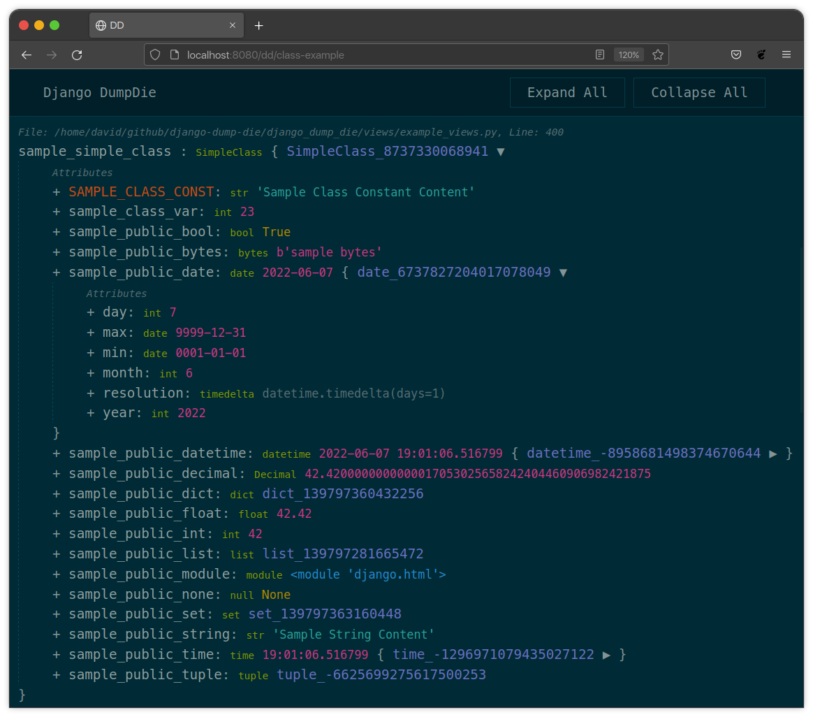

Welcome to Django-Dump-Die's documentation!
*******************************************

Django-Dump-Die is a `Django <https://www.djangoproject.com/>`_ app that
provides a couple of debug tools, in the form of built-in methods
``dump`` and ``dd``. These allow sending details about a variable to the
browser for inspection.

Dumped variables are presented in an easy to read and
fully expandable / collapsible tree. You can easily understand complex objects
and the results of django queries with a simple call to either method.

This dump die output will intercept any page rendering, instead providing a
separate response provided by Django-Dump-Die, with detailed information about
the corresponding variables passed for inspection.

The entire concept is heavily based on the dump die functionality that comes
with Php's `Laravel <https://laravel.com/>`_ and Symfony.

.. toctree::
   :maxdepth: 2
   :caption: Table of Contents

   quickstart
   usage
   configuration
   api_reference

Indices and tables
******************

* :ref:`genindex`
* :ref:`modindex`
* :ref:`search`
