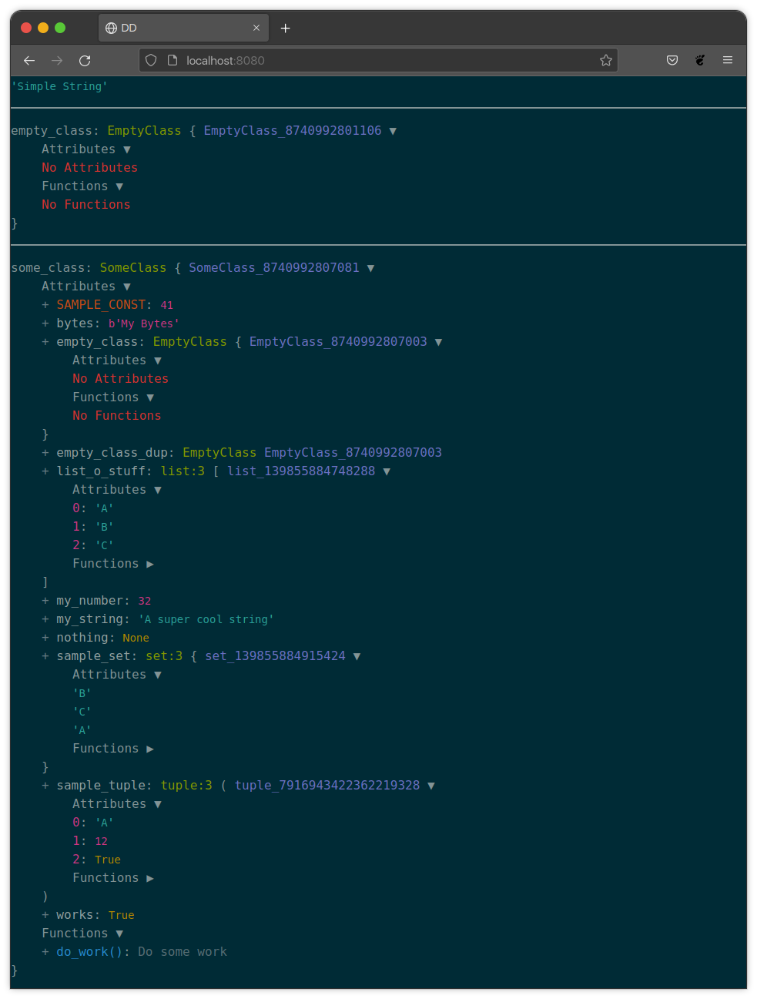

Usage
*****

General
=======
The middleware is where most of this package's heavy lifting happens.

By having the middleware installed, you can run ``dump(<variable>)`` and/or
``dd(<variable>)`` anywhere you want, and it will run the dump logic.
No importing or extra logic is required.

Each ``dump(<variable>)`` command will add the object passed to dump to an
internal list that will be dumped either when a ``dd(<variable>)`` is used
or if the entirety of the request finishes.
You can have as many ``dump(<variable>)`` statements as you want leading up to
a ``dd(<variable>)``.

If you make a call to ``dd(<variable>)``, execution will immediately stop and
all dumped objects including the the one sent to dd will be output.

If you do not make a call to ``dd(<variable>)`` and only use
``dump(<variable>)`` statements, the request will continue processing until it
is time to return the response at which point it will replace the response with
the data that has been dumped thus far.

Example
=======

.. code-block:: python

    # Sample classes for output.
    class EmptyClass:
        """Empty Class."""
        pass

    class SomeClass:
        """Some Class."""
        SAMPLE_CONST = 41

        def __init__(self, *args, **kwargs):
            self.my_number = 32
            self.my_string = 'A super cool string'
            self.works = True
            self.nothing = None
            self.bytes = bytes('My Bytes', 'utf-8')
            self.list_o_stuff = ['A', 'B', 'C']
            self.sample_set = {'A', 'B', 'C'}
            self.sample_tuple = ('A', 12, True)
            self.empty_class = EmptyClass()
            self.empty_class_dup = self.empty_class

        def do_work(self):
            """Do some work"""
            return True

    # Example Usage
    empty_class = EmptyClass()
    some_class = SomeClass()

    dump('Simple String')
    dump(empty_class)
    dd(some_class)

.. note::

    Most editors will give a red error squiggle for the dd command.
    This is intentional, and the command will still run. This is because this
    command is meant to be used for debugging, and is not meant to stay
    long-term. The red squiggle helps identify it as something that should be
    removed before any actual commits.

Available Parameters
====================

Both the ``dd()`` and ``dump()`` functions take the same parameters, in the
same ordering:

index_range
-----------

:Type: ``int, list, tuple``
:Default: ``None``

An index range to modify output values of parent entity (if iterable).
Allows changing the range of which direct-child indexes are fully examined.
Only affects the direct children of the outermost parent object. Can be useful
with large datasets, when only wanting to examine a specific range of values.

When an index range is passed, the end index of that range overrides the
``DJANGO_DD_MAX_ITERABLE_LENGTH`` value set in settings.

Value can be:

* A single index.
* A range of two values, to specify starting and ending index (defined such as
  in a list or tuple).

Example::

    # Single index
    dump(my_list, index_range=18)  # Will do from index 18 to 18 + DJANGO_DD_MAX_ITERABLE_LENGTH
    # Range index
    dd(my_list, index_range=(18, 37))  # Will do from index 18 to 37

deepcopy
--------

:Type: ``bool``
:Default: ``False``

A boolean to specify if passed objects should be deep-copied before being
passed into dd/dump logic. If set to ``True``, then preserves exact state of
object at time of passing into dd/dump. Useful if you are dumping an object,
then making changes to that object, and then dumping it again.

Example::

    # Dump starting state
    dump(my_list, deepcopy=True)
    # Update list
    my_list[5] = 42
    # Dump updated state
    dd(my_list)

Inside A Template
=================

There is a template tag that can also be used to dump from inside a template.
However, the use of this tag comes with a lot of caveats.

.. note::

    Only the dump tag is provided. A dd tag is not provided as template
    rendering is already occurring and trying to stop execution of the
    rendering mid-render can be difficult.

.. warning::

    Additionally, the template tag needs to pull in some JS & CSS for both
    Bootstrap and jQuery. These lines are loaded in as part of the processing
    that the dump tag does. As a result, these loads are done immediately
    before rendering out the dumped data and thus may occur in the middle of
    the HTML document. Due to this, it is possible that CSP rules could prevent
    the required JS & CSS from properly loading.

In order to use the template tag from a template you must load the template
tags via a load tag before you can use the dump tag.

.. code:: html+django

    

Once the tag library has been loaded you can dump out a variable by using the
dump tag.

.. code:: html+django

    

.. note::

    There are no extra parameters that can be sent to the tag like there are
    for the python code versions. The only parameter that can be sent is the
    object to be dumped. In general, you should be doing the majority of your
    dumping from python code.

.. note::

    The output for this dump will not contain the name of the variable being
    dumped nor the filename and line number that the dump was called from.

.. note::

    Because the CSS for the page will be a mash-up of your project and the
    required styling for the dump, it is likely that you will see lots of
    changes to your site when using this tag. This is normal.
